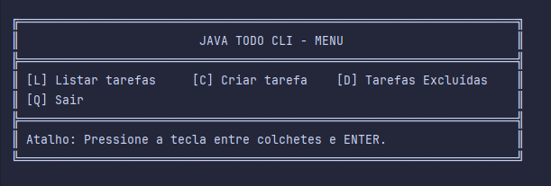
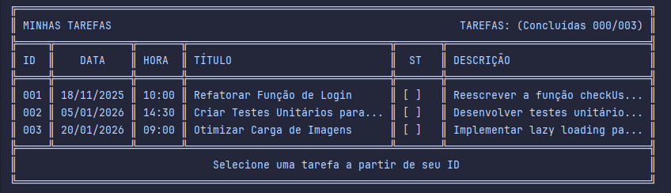
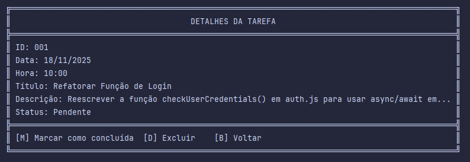
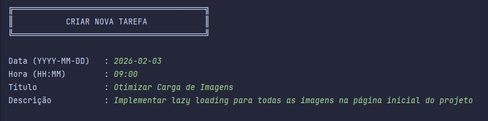

# 📋 TODO CLI

Projeto CLI para gerenciar tarefas simples em Java usando Maven.

## Visão geral

Aplicação em linha de comando que permite criar, listar e gerenciar tarefas. Organização em camadas simples: `view` (
entrada/saída), `service` (lógica), `repository` (persistência em memória/arquivo), `model` (entidades) e `util` (
helpers).

## Arquitetura e organização

\- Código fonte em `src/main/java/com/todocli`  
\- Principais pacotes:  
\- `config` \- configuração (ex.: `ConnectionFactory`)  
\- `model` \- classes de domínio (ex.: `Task`)  
\- `repository` \- acesso/armazenamento (ex.: `TaskRepository`)  
\- `service` \- regras de negócio (ex.: `TaskService`)  
\- `view` \- componentes de interface CLI (ex.: `Home`, `TasksList`, `CreateTask`)  
\- `util` \- utilitários (ex.: `CliUtils`)  
\- Ponto de entrada: `src/main/java/com/todocli/Main.java`

## Como executar localmente

Requisitos: Java 17\+, Maven, Docker e uma IDE (IntelliJ recomendada).

- Instalar dependências Maven: `mvn clean install`
- Iniciar um container com o Docker Compose: `docker-compose up -d`
- Acessar o `bash` para dar comandos no banco de dados: `docker exec -it mysql bash`
- Criar um `DATABASE` no banco de dados MySQL: `CREATE DATABASE todocli;`

- Rodar direto pela IDE: abrir o projeto em IntelliJ e executar a classe `Main` (`src/main/java/com/todocli/Main.java`).

## Observações

- Projeto simples e pensado para uso local/educacional.
- Ajustar persistência em `TaskRepository` conforme necessário (arquivo, banco, etc.).
